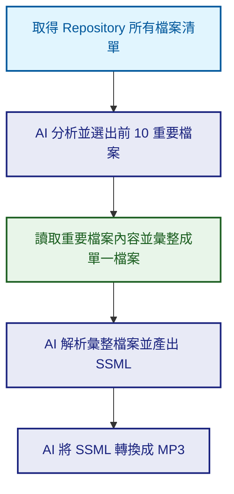

這是一個有趣的運用，就像 NotebookLM 一樣，可以產出 podcast，不同的是這個專案是專門針對 GitHub Repository 的，只要輸入 Repository 的網址，就可以轉換成 Podcast，這樣就可以透過聽 Podcast 來了解 Repository 的內容。

- GitHub repository: [GitPodcast](https://github.com/BandarLabs/gitpodcast)
- 網站：[https://www.gitpodcast.com/](https://www.gitpodcast.com/)

## 如何使用 GitPodcast

1. 輸入 Repository 網址
    
    在首頁輸入你想了解的 GitHub Repository 網址。

2. 點擊 `Podcast`
    
    點擊按鈕，開始生成 Podcast。

3. 等待生成
    
    系統會分析 Repository 的內容，並轉換成 Podcast。

4. 播放 Podcast
    
    播放生成的 Podcast，就可以聽兩位主持人解說該專案！

5. 下載 Podcast
    
    也可以下載 Podcast，隨時隨地聽。

## 背後核心技術

根據專案的原始碼，製作一份流程圖，方便讓大家快速了解這個專案背後技術的運作流程。

註：SSML 是 Speech Synthesis Markup Language 的縮寫，是一種用於語音合成的標記語言。
